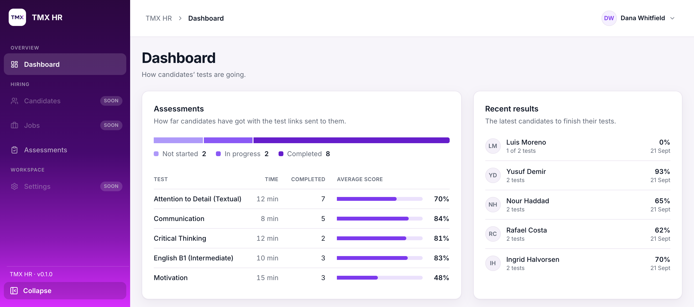
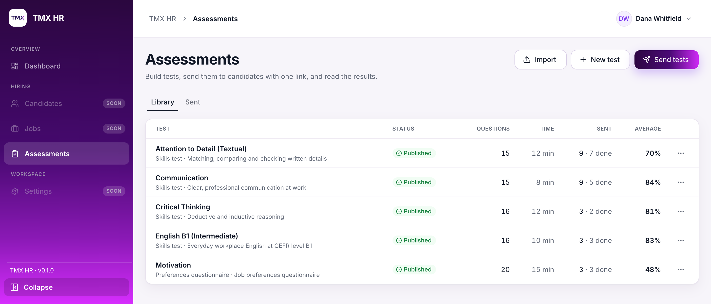
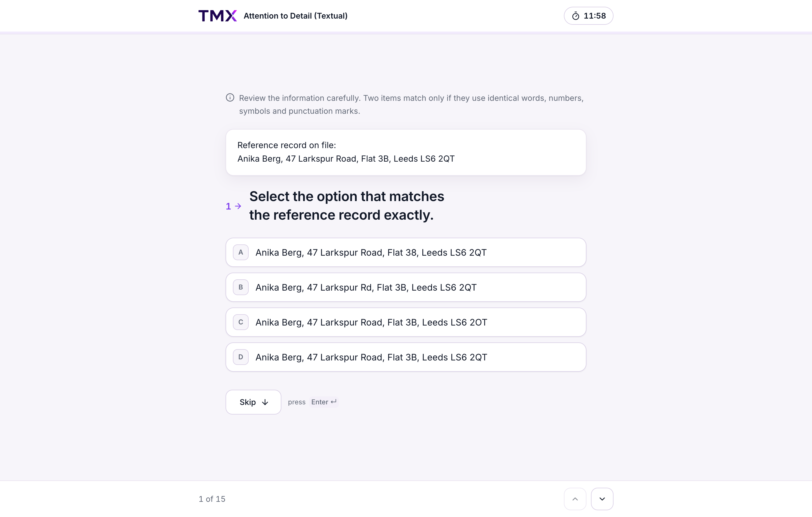
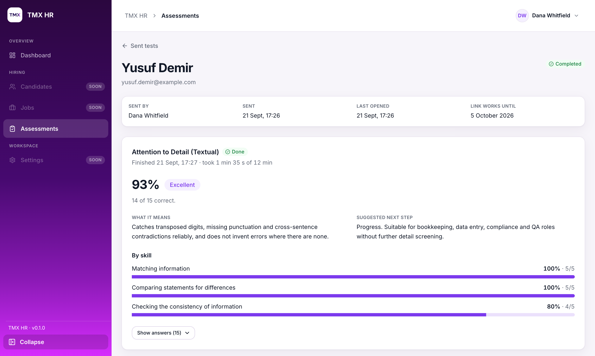

# TMX HR

[](https://github.com/TokenMinds-co/tmx-hr/actions/workflows/ci.yml)
[](LICENSE)

An open-source recruitment app with built-in timed candidate assessments.

Staff build multiple-choice tests — sections, audio questions, scoring bands, CSV import and
export — and send them to a candidate in one email. The candidate opens a single link, with no
account to create, and the server keeps the clock, scores the answers and puts each result in a
band. Five ready-made tests ship with it. It's for small teams who screen candidates themselves
and would rather run the tests on their own server, with the questions and the candidates' data
in their own database.

The assessment side is built and covered by tests. A recruitment pipeline — jobs, stages,
applications — is designed in the docs but not written yet; see
[Status and roadmap](#status-and-roadmap).

## Screenshots

<table>
  <tr>
    <td width="50%">
      
      <br><sub><b>The staff dashboard</b></sub>
    </td>
    <td width="50%">
      
      <br><sub><b>The test library</b></sub>
    </td>
  </tr>
  <tr>
    <td width="50%">
      
      <br><sub><b>What a candidate sees</b></sub>
    </td>
    <td width="50%">
      
      <br><sub><b>A candidate's results</b></sub>
    </td>
  </tr>
</table>

## Features

- **Tests you build yourself.** Single choice, true/false, rating scales and ordered choice
  scales. Sections with weights, per-question audio, a passage or scenario above the question,
  a time limit per test, fixed or shuffled question order, and score bands with labels and a
  recommended action.
- **Two ways to score.** Right answers (correct ÷ questions, plus a score per section), or
  alignment, where each answer is compared with the role profile's own answer and a gap of two
  or more points is flagged for staff. Scoring runs on the server, in
  [plain functions with their own tests](backend/src/assessments/canonical/).
- **Questions in and out as CSV**, so a test can be written in a spreadsheet, and as a canonical
  JSON document for a whole test, so tests can be reviewed in a pull request or moved between
  installations. A dry-run import reports every error by row and column before anything is saved.
- **One emailed link per candidate,** holding up to five tests. No account and no details to
  re-enter. Only the link's SHA-256 hash is stored. Links last 14 days by default, can be resent
  (which kills the old one) and can be revoked mid-test.
- **The server owns the clock.** It sets each attempt's deadline, allows 30 seconds' grace, and
  closes an overdue attempt by scoring the answers saved so far. The question order is drawn once
  per attempt, so a refresh doesn't reshuffle, and candidates' payloads are built field by field
  so an answer key can't leak into the browser.
- **Every send freezes a copy of the test.** Editing a template later never changes a test a
  candidate already holds, and never rescores a result.
- **Results for staff:** the score and its band, section scores, flags, time taken, and every
  answer next to the expected one. Candidates see a thank-you screen, never a score.
- **Five ready-made tests** as seed data — motivation, communication, attention to detail,
  critical thinking and English B1 — with their audio. `pnpm db:seed` loads them.
- **Invite-only staff accounts:** email and password, Argon2id hashing, server-side sessions in
  an httpOnly cookie, admin and member roles, password reset, and a first admin created from the
  command line.
- **Interactive API docs** (Swagger UI) at `/api/docs`, liveness and readiness checks for a load
  balancer, and per-IP rate limits.

## Status and roadmap

| Area | State |
| --- | --- |
| Staff authentication | Built: sign-in, sessions, invitations, password reset, roles |
| Assessments | Built: building, importing, previewing, sending, taking, scoring, results |
| Dashboard | Built: one endpoint, real numbers |
| Recruitment pipeline (jobs, stages, applications) | **Designed, not built.** The requirements and the open questions are in [backend/docs/recruitment-pipeline.md](backend/docs/recruitment-pipeline.md) and [frontend/docs/recruitment-pipeline.md](frontend/docs/recruitment-pipeline.md); there is no code and no database model behind them yet. |
| Question generation | Not started. Questions are written by hand, in a spreadsheet or in the editor, from written test specifications. See [backend/docs/question-generation.md](backend/docs/question-generation.md). |

Known gaps, so you don't find them the hard way:

- **No user management API.** There's no endpoint to list staff, change a role or deactivate
  someone; today that's done in the database with `pnpm db:studio`.
- **The frontend has no test suite.** The backend has unit and end-to-end tests.
- **Light theme only,** and uploaded files are kept on local disk behind a storage interface, so
  more than one API instance would need that interface pointed somewhere shared.

### Design rules

Two rules shape the parts that aren't built yet, and they're worth knowing before you add to
this repository:

- **Recruitment stages and status categories change over time,** so they're stored as data, not
  as enums in code.
- **The person responsible for each stage changes too,** so stage ownership is data as well,
  rather than a fixed role.

## Quick start

You need:

- **Node.js 24.** That's what [`.nvmrc`](.nvmrc) pins and what CI runs; the `engines` field in
  both packages also accepts 20.19+ and 22.12+.
- **pnpm 11.8.0**, pinned in `packageManager` in both `package.json` files. `corepack enable`
  picks up the pinned version on its own.

You don't need a Postgres of your own, and you don't need a Resend account: while
`RESEND_API_KEY` is empty, no email is sent and every message — including the invitation and
candidate links you need to click — is printed in the backend's terminal.

### The backend, with pnpm

```bash
cd backend
pnpm install        # also runs prisma generate
cp .env.example .env
pnpm db:start       # starts a local Prisma Postgres and prints its URL
pnpm db:migrate     # creates the tables
pnpm db:seed        # optional: loads the five ready-made tests and their audio
pnpm start:dev
```

**`pnpm db:start` prints a `postgres://…` URL. Paste it into `.env` as `DATABASE_URL` before
you run `pnpm db:migrate`,** or the migration has nothing to connect to. This is the step people
miss. The API is then at http://localhost:4000/api and its docs at
http://localhost:4000/api/docs.

### The backend, in Docker

[`backend/docker-compose.local.yml`](backend/docker-compose.local.yml) runs Postgres and the API
together. Nothing has to exist on the machine first and there's no `.env` to write:

```bash
cd backend
docker compose -f docker-compose.local.yml up --build
docker compose -f docker-compose.local.yml exec backend node dist/cli/seed-assessments
docker compose -f docker-compose.local.yml down     # -v also deletes the data
```

Migrations aren't a step: the image runs `prisma migrate deploy` before the API listens. Emails
appear in `docker compose logs backend`. The other two compose files in that folder are the
deployed shape of the app — they attach to an external network and expect a Postgres that
already exists, so they won't start on a fresh machine.

### The frontend

The frontend isn't in the compose file; run it with pnpm either way.

```bash
cd frontend
pnpm install
cp .env.example .env   # API_URL: where the backend runs, default http://localhost:4000
pnpm dev
```

The app is at http://localhost:3000. It rewrites `/api/*` to the backend, so the browser only
ever talks to port 3000 and the session cookie stays first-party.

### Your first account

Accounts are invite-only, so the first admin comes from the command line:

```bash
cd backend
pnpm auth:invite-admin --email you@example.com --name "Your Name"

# or, with the Docker stack running:
docker compose -f docker-compose.local.yml exec backend \
  node dist/cli/invite-admin --email you@example.com --name "Your Name"
```

It prints the invitation link. Open it with the frontend running, choose a password, and you're
signed in. To try the candidate side, send a test to your own address and click the link printed
in the backend's terminal.

### The name candidates see

Emails and the candidate pages say "TMX HR" until you change it. Set `COMPANY_NAME` in
`backend/.env` and `NEXT_PUBLIC_COMPANY_NAME` in `frontend/.env` to the same value; the frontend
inlines its copy at build time, so that one needs a rebuild rather than a restart. Every variable
is described in [backend/docs/configuration.md](backend/docs/configuration.md) and
[frontend/docs/configuration.md](frontend/docs/configuration.md).

## Repository layout

| Path | What it is | Docs |
| --- | --- | --- |
| [`backend/`](backend/) | REST API: NestJS 11, TypeScript, Prisma 7 with PostgreSQL, Resend for email | [README](backend/README.md) · [docs](backend/docs/) · [changelog](backend/docs/CHANGELOG.md) |
| [`frontend/`](frontend/) | Web app: Next.js 16 App Router, React 19, TanStack Query, Tailwind CSS 4, shadcn/ui | [README](frontend/README.md) · [docs](frontend/docs/) · [changelog](frontend/docs/CHANGELOG.md) |
| [`backend/seed/`](backend/seed/) | The five ready-made tests as canonical JSON, their audio, and the source workbooks they were converted from | [database.md](backend/docs/database.md#seed-data) |
| [`.github/workflows/`](.github/workflows/) | `ci.yml` (checks) and `deploy.yml` (ship `main`) | [operations.md](backend/docs/operations.md#deployment) |

`backend/` and `frontend/` are **two separate pnpm projects, not a workspace**: each has its own
`package.json` and its own lockfile, so install and run each one from its own folder.

## Deployment

**Checks.** [`.github/workflows/ci.yml`](.github/workflows/ci.yml) runs on every pull request and
every push to `main`: the backend's build, lint and unit tests; its end-to-end tests against a
throwaway Postgres service container; a Docker image build that pushes nothing; and the
frontend's lint and production build. Nothing in it reads a secret or reaches a server, so it
runs the same way on a fork.

**Shipping the backend.** [`.github/workflows/deploy.yml`](.github/workflows/deploy.yml) builds
the image from [`backend/Dockerfile`](backend/Dockerfile), pushes it to a container registry
tagged with the commit, then over SSH pulls it on a Linux server, restarts the compose stack and
waits for `/api/health/ready` to answer before it calls the deploy good — failing if the running
container isn't the image it just pushed. The image applies pending migrations on boot. **Both
jobs are guarded by a check on the repository name, so a fork never tries to deploy**; point it
at your own host, or delete it and deploy the image however you like.

**The frontend** is a stock Next.js app and runs on any Next.js host. It needs `API_URL` both
when building (the `/api` rewrite is fixed at build time) and when running.

The server-side details — the compose files, the environment, health checks and how to run the
first-admin and seed commands inside the container — are in
[backend/docs/operations.md](backend/docs/operations.md).

## Documentation

Most questions about why something works the way it does are already answered in
`backend/docs/` and `frontend/docs/`, and keeping them answered there is a condition of merging.

**One file per area,** kebab-case: `authentication.md`, `database.md`, `query-keys.md`. A file
covers one area only. If it starts covering two, split it. Each doc opens with a status (**Not
started**, **Scaffold only**, **In progress** or **Done**) and the date it was last updated, then
keeps this section order:

| Section | What goes in it |
| --- | --- |
| Scope | What the area covers, and what belongs in another doc |
| Current state | What exists in the code today, with links into it |
| Requirements | What has been agreed |
| Proposed approach | Suggestions nobody has agreed to yet. Once the area is built, rename it to "How it works" and describe the real code. |
| Decisions | Questions that have been answered: the decision, why, and where it came from |
| Open decisions | Questions that still need an answer |
| References | Related docs and agent skill rules |

**The Decisions table is the part worth copying.** Every design choice made while building the
app is written down with its reason and its origin, in four columns — Question, Decision, Why,
Source — and `Source` is one of exactly two values:

- **`Requested`** — asked for by the maintainers. Don't change it in a pull request; open an
  issue instead.
- **`Build default`** — chosen while building, for the reason in the "Why" column, and open to
  change. If you have a better answer, say so and update the row.

That one column is what makes a five-year-old decision arguable instead of mysterious: you can
tell a constraint from a coin-flip without asking anyone. When a question under "Open decisions"
gets answered, it moves up into the table rather than living in both places.

**A change to an area updates that area's doc in the same pull request as the code,** along with
the status in the package README and a line in that package's changelog
([backend](backend/docs/CHANGELOG.md), [frontend](frontend/docs/CHANGELOG.md); the root
[CHANGELOG.md](CHANGELOG.md) only points at those two).

Both packages also keep vendored agent skills in `.agents/skills/` for whoever works with a
coding agent. They aren't tracked in git — only the lockfiles are — and
`pnpm dlx skills experimental_install` in each package restores them. What they're for is in
[frontend/AGENTS.md](frontend/AGENTS.md).

## Contributing

[CONTRIBUTING.md](CONTRIBUTING.md) covers getting it running, the tests, the commit convention
and what a change has to include before it can be merged. Small fixes can go straight to a pull
request; anything larger starts as an issue. Everyone taking part agrees to the
[Code of Conduct](CODE_OF_CONDUCT.md).

The easiest place to start is an area doc's "Open decisions" list.

## Security

The app stores people's personal data. **Don't open a public issue for a security problem** —
[SECURITY.md](SECURITY.md) explains how to report one privately. Never commit real candidate
data, in fixtures, screenshots or issue reports.

## Licence

[MIT](LICENSE).

### Trademarks

The MIT licence covers the code. It does **not** cover the name "TMX HR" or the logo images in
[`frontend/public/brand/`](frontend/public/brand/) and the icons `frontend/app/icon.png` and
`frontend/app/apple-icon.png`. If you run a fork, set `COMPANY_NAME` and
`NEXT_PUBLIC_COMPANY_NAME` to your own company's name and replace those images with your own —
candidates are emailed under that name, and it's the name on the page where they take the tests.
